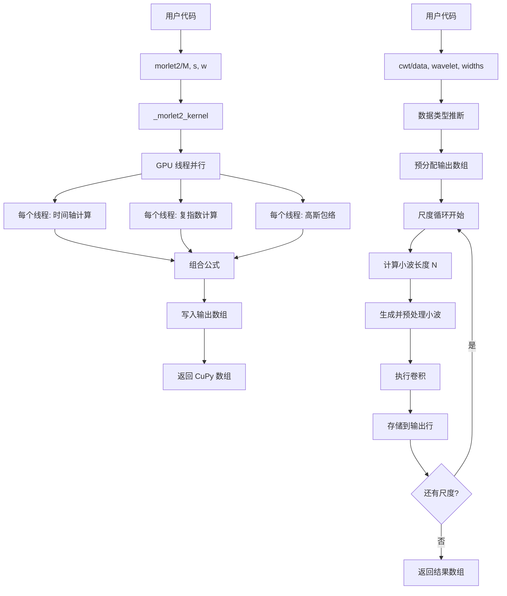

# morlet2 算子的 Python 源码算法

## 一、代码定位与接口概览

### 1.1 公开导入路径

morlet2 通过以下路径公开导出:

```python
import cusignal
wavelet = cusignal.morlet2(M, s, w=5)
```

或直接导入:

```python
from cusignal import morlet2
wavelet = morlet2(M, s, w=5)
```

### 1.2 定义文件与符号名

- **模块文件:** `cusignal/wavelets/wavelets.py`
- **符号名:** `morlet2` (函数)
- **只读基准行号:** [cusignal-23.08.00/python/cusignal/wavelets/wavelets.py#L198-L256](../../../../cusignal-23.08.00/python/cusignal/wavelets/wavelets.py#L198-L256)
- **学习副本行号:** [Learning/cusignal-23.08.00/python/cusignal/wavelets/wavelets.py#L198-L256](../../../cusignal-23.08.00/python/cusignal/wavelets/wavelets.py#L198-L256) (待插入注释)

### 1.3 导出机制

文件:[cusignal/wavelets/__init__.py](../../../../cusignal-23.08.00/python/cusignal/wavelets/__init__.py#L14)

```python
from cusignal.wavelets.wavelets import cwt, morlet, morlet2, qmf, ricker
```

### 1.4 函数签名

```python
def morlet2(M, s, w=5):
    """
    Complex Morlet wavelet, designed to work with `cwt`.

    Parameters
    ----------
    M : int
        Length of the wavelet.
    s : float
        Width parameter of the wavelet.
    w : float, optional
        Omega0. Default is 5

    Returns
    -------
    morlet : (M,) ndarray

    See Also
    --------
    morlet : Implementation of Morlet wavelet, incompatible with `cwt`
    """
```

**参数语义:**
- `M` (int): 输出数组的离散点数,控制小波的采样密度
- `s` (float): 尺度参数(宽度),对应物理时间尺度,决定小波的时域展宽程度
- `w` (float): 中心角频率参数 $\omega_0$,默认值 5

**返回值语义:**
- 返回 `(M,)` 形状的复数数组,数据类型为 `complex128`
- 实部对应余弦分量,虚部对应正弦分量

## 二、当前算子的完整相关源码

### 2.1 morlet2 函数定义

**来源:** 只读基准 [cusignal-23.08.00/python/cusignal/wavelets/wavelets.py#L180-L256](../../../../cusignal-23.08.00/python/cusignal/wavelets/wavelets.py#L180-L256)

```python
_morlet2_kernel = cp.ElementwiseKernel(
    "float64 w, float64 s",
    "complex128 output",
    """
    const double x { ( i - ( _ind.size() - 1.0 ) * 0.5 ) / s };

    thrust::complex<double> temp { exp(
        thrust::complex<double>( 0, w * x ) ) };

    output = sqrt( 1 / s ) * temp * exp( -0.5 * ( x * x ) ) *
        pow( M_PI, -0.25 )
    """,
    "_morlet_kernel",
    options=("-std=c++11",),
    loop_prep="",
)


def morlet2(M, s, w=5):
    """
    Complex Morlet wavelet, designed to work with `cwt`.
    Returns the complete version of morlet wavelet, normalised
    according to `s`::
        exp(1j*w*x/s) * exp(-0.5*(x/s)**2) * pi**(-0.25) * sqrt(1/s)
    Parameters
    ----------
    M : int
        Length of the wavelet.
    s : float
        Width parameter of the wavelet.
    w : float, optional
        Omega0. Default is 5
    Returns
    -------
    morlet : (M,) ndarray
    See Also
    --------
    morlet : Implementation of Morlet wavelet, incompatible with `cwt`
    Notes
    -----
    .. versionadded:: 1.4.0
    This function was designed to work with `cwt`. Because `morlet2`
    returns an array of complex numbers, the `dtype` argument of `cwt`
    should be set to `complex128` for best results.
    Note the difference in implementation with `morlet`.
    The fundamental frequency of this wavelet in Hz is given by::
        f = w*fs / (2*s*np.pi)
    where ``fs`` is the sampling rate and `s` is the wavelet width parameter.
    Similarly we can get the wavelet width parameter at ``f``::
        s = w*fs / (2*f*np.pi)
    Examples
    --------
    >>> from scipy import signal
    >>> import matplotlib.pyplot as plt
    >>> M = 100
    >>> s = 4.0
    >>> w = 2.0
    >>> wavelet = signal.morlet2(M, s, w)
    >>> plt.plot(abs(wavelet))
    >>> plt.show()
    This example shows basic use of `morlet2` with `cwt` in time-frequency
    analysis:
    >>> from scipy import signal
    >>> import matplotlib.pyplot as plt
    >>> t, dt = np.linspace(0, 1, 200, retstep=True)
    >>> fs = 1/dt
    >>> w = 6.
    >>> sig = np.cos(2*np.pi*(50 + 10*t)*t) + np.sin(40*np.pi*t)
    >>> freq = np.linspace(1, fs/2, 100)
    >>> widths = w*fs / (2*freq*np.pi)
    >>> cwtm = signal.cwt(sig, signal.morlet2, widths, w=w)
    >>> plt.pcolormesh(t, freq, np.abs(cwtm),
        cmap='viridis', shading='gouraud')
    >>> plt.show()
    """

    return _morlet2_kernel(w, s, size=M)
```

### 2.2 cwt 函数定义

**来源:** 只读基准 [cusignal-23.08.00/python/cusignal/wavelets/wavelets.py#L259-L321](../../../../cusignal-23.08.00/python/cusignal/wavelets/wavelets.py#L259-L321)

```python
def cwt(data, wavelet, widths):
    """
    Continuous wavelet transform.

    Performs a continuous wavelet transform on `data`,
    using the `wavelet` function. A CWT performs a convolution
    with `data` using the `wavelet` function, which is characterized
    by a width parameter and length parameter.

    Parameters
    ----------
    data : (N,) ndarray
        data on which to perform the transform.
    wavelet : function
        Wavelet function, which should take 2 arguments.
        The first argument is the number of points that the returned vector
        will have (len(wavelet(length,width)) == length).
        The second is a width parameter, defining the size of the wavelet
        (e.g. standard deviation of a gaussian). See `ricker`, which
        satisfies these requirements.
    widths : (M,) sequence
        Widths to use for transform.

    Returns
    -------
    cwt: (M, N) ndarray
        Will have shape of (len(widths), len(data)).

    Notes
    -----
    ::

        length = min(10 * width[ii], len(data))
        cwt[ii,:] = cusignal.convolve(data, wavelet(length,
                                    width[ii]), mode='same')

    Examples
    --------
    >>> import cusignal
    >>> import cupy as cp
    >>> import matplotlib.pyplot as plt
    >>> t = cp.linspace(-1, 1, 200, endpoint=False)
    >>> sig  = cp.cos(2 * cp.pi * 7 * t) + cusignal.gausspulse(t - 0.4, fc=2)
    >>> widths = cp.arange(1, 31)
    >>> cwtmatr = cusignal.cwt(sig, cusignal.ricker, widths)
    >>> plt.imshow(abs(cp.asnumpy(cwtmatr)), extent=[-1, 1, 31, 1],
                   cmap='PRGn', aspect='auto', vmax=abs(cwtmatr).max(),
                   vmin=-abs(cwtmatr).max())
    >>> plt.show()

    """
    if cp.asarray(wavelet(1, 1)).dtype.char in "FDG":
        dtype = cp.complex128
    else:
        dtype = cp.float64

    output = cp.empty([len(widths), len(data)], dtype=dtype)

    for ind, width in enumerate(widths):
        N = np.min([10 * int(width), len(data)])
        wavelet_data = cp.conj(wavelet(N, int(width)))[::-1]
        output[ind, :] = convolve(data, wavelet_data, mode="same")
    return output
```

### 2.3 直接依赖:convolve 函数

morlet2 和 cwt 都依赖于 cusignal 的卷积函数:

**导入位置:** [cusignal/wavelets/wavelets.py#L17](../../../../cusignal-23.08.00/python/cusignal/wavelets/wavelets.py#L17)

```python
from ..convolution.convolve import convolve
```

**语义:** 执行快速卷积运算,支持 FFT 加速和 GPU 并行化。本学习不展开卷积实现细节,仅理解其接口语义。

## 三、docstring 逐行翻译与解释

### 3.1 morlet2 docstring 逐行解释

| 原文(英文) | 中文翻译 | 解释 |
|-----------|---------|------|
| Complex Morlet wavelet, designed to work with `cwt`. | 复 Morlet 小波,设计用于配合 `cwt` 工作。 | 明确指出 morlet2 的设计目标是与连续小波变换函数协同使用。 |
| Returns the complete version of morlet wavelet, normalised according to `s`:: | 返回 morlet 小波的完整版本,根据 `s` 进行归一化:: | 强调两个特性:(1)完整版本(含归一化);(2)尺度相关的能量归一化。 |
| exp(1j*w*x/s) * exp(-0.5*(x/s)**2) * pi**(-0.25) * sqrt(1/s) | exp(1j*w*x/s) * exp(-0.5*(x/s)**2) * pi**(-0.25) * sqrt(1/s) | 核心数学公式,直接对应数学物理原理中的 Morlet 小波构造。 |
| Parameters | 参数 | 参数说明开始。 |
| M : int | M : int | 第一个参数 M,整数类型。 |
| Length of the wavelet. | 小波的长度。 | M 控制输出数组的离散点数,影响采样密度和计算精度。 |
| s : float | s : float | 第二个参数 s,浮点类型。 |
| Width parameter of the wavelet. | 小波的宽度参数。 | s 是尺度参数,对应物理时间尺度,决定小波在时域的展宽程度。 |
| w : float, optional | w : float, 可选 | 第三个参数 w,浮点类型,可选参数。 |
| Omega0. Default is 5 | Omega0。默认值为 5 | w 是中心角频率参数 $\omega_0$,默认值 5 是经验最优值,平衡时频分辨率。 |
| Returns | 返回值 | 返回值说明开始。 |
| morlet : (M,) ndarray | morlet : (M,) ndarray | 返回一个形状为 (M,) 的数组。 |
| See Also | 另请参阅 | 相关函数交叉引用。 |
| morlet : Implementation of Morlet wavelet, incompatible with `cwt` | morlet : Morlet 小波的实现,与 `cwt` 不兼容 | 提醒用户区分 morlet 和 morlet2,前者不支持 cwt。 |
| Notes | 注释 | 详细说明开始。 |
| .. versionadded:: 1.4.0 | .. 版本添加:: 1.4.0 | 标明函数引入版本。 |
| This function was designed to work with `cwt`. | 此函数设计用于配合 `cwt` 工作。 | 再次强调设计目标。 |
| Because `morlet2` returns an array of complex numbers, the `dtype` argument of `cwt` should be set to `complex128` for best results. | 因为 `morlet2` 返回复数数组,`cwt` 的 `dtype` 参数应设置为 `complex128` 以获得最佳结果。 | 提示数据类型匹配,确保复数运算的精度和性能。 |
| Note the difference in implementation with `morlet`. | 注意与 `morlet` 实现的区别。 | 提醒用户对比两个函数的差异。 |
| The fundamental frequency of this wavelet in Hz is given by:: | 此小波的基本频率(单位 Hz)由下式给出:: | 引入频率-尺度转换公式。 |
| f = w*fs / (2*s*np.pi) | f = w*fs / (2*s*np.pi) | 核心转换公式,对应数学物理原理中的频率-尺度关系。 |
| where ``fs`` is the sampling rate and `s` is the wavelet width parameter. | 其中 ``fs`` 是采样率,`s` 是小波宽度参数。 | 解释公式中的符号含义。 |
| Similarly we can get the wavelet width parameter at ``f``:: | 类似地,我们可以从频率 ``f`` 得到小波宽度参数:: | 给出逆向公式。 |
| s = w*fs / (2*f*np.pi) | s = w*fs / (2*f*np.pi) | 逆向转换公式,用于根据目标频率选择尺度。 |

### 3.2 cwt docstring 逐行解释

| 原文(英文) | 中文翻译 | 解释 |
|-----------|---------|------|
| Continuous wavelet transform. | 连续小波变换。 | 函数名称和主要功能。 |
| Performs a continuous wavelet transform on `data`, using the `wavelet` function. | 对 `data` 执行连续小波变换,使用 `wavelet` 函数。 | 描述核心操作。 |
| A CWT performs a convolution with `data` using the `wavelet` function, which is characterized by a width parameter and length parameter. | CWT 使用 `wavelet` 函数与 `data` 进行卷积,小波函数由宽度参数和长度参数刻画。 | 解释实现机制:卷积而非积分。 |
| Parameters | 参数 | 参数说明开始。 |
| data : (N,) ndarray | data : (N,) ndarray | 输入信号,一维数组。 |
| data on which to perform the transform. | 执行变换的数据。 | 明确输入数据的作用。 |
| wavelet : function | wavelet : function | 小波生成函数,接受两个参数。 |
| Wavelet function, which should take 2 arguments. | 小波函数,应该接受 2 个参数。 | 约束小波函数的接口规范。 |
| The first argument is the number of points that the returned vector will have (len(wavelet(length,width)) == length). | 第一个参数是返回向量的点数(len(wavelet(length,width)) == length)。 | 第一个参数是长度 M。 |
| The second is a width parameter, defining the size of the wavelet (e.g. standard deviation of a gaussian). See `ricker`, which satisfies these requirements. | 第二个是宽度参数,定义小波的大小(例如高斯的标准差)。参见 `ricker`,它满足这些要求。 | 第二个参数是尺度 s,给出实例。 |
| widths : (M,) sequence | widths : (M,) sequence | 尺度序列,一维数组。 |
| Widths to use for transform. | 用于变换的宽度。 | 指定多个尺度进行多分辨率分析。 |
| Returns | 返回值 | 返回值说明开始。 |
| cwt: (M, N) ndarray | cwt: (M, N) ndarray | 返回二维数组,形状为 (尺度数, 信号长度)。 |
| Will have shape of (len(widths), len(data)). | 形状为 (len(widths), len(data))。 | 明确输出维度。 |
| Notes | 注释 | 实现细节说明。 |
| length = min(10 * width[ii], len(data)) | length = min(10 * width[ii], len(data)) | 小波长度自适应公式,限制最大长度。 |
| cwt[ii,:] = cusignal.convolve(data, wavelet(length, width[ii]), mode='same') | cwt[ii,:] = cusignal.convolve(data, wavelet(length, width[ii]), mode='same') | 核心算法:卷积运算,'same'模式保持输出长度与输入相同。 |

## 四、源代码逐行解释

### 4.1 _morlet2_kernel CUDA kernel 逐行解释

**行号:** [180-195](../../../../cusignal-23.08.00/python/cusignal/wavelets/wavelets.py#L180-L195)

| 行号 | 源码 | 解释 |
|-----|------|------|
| 180 | `_morlet2_kernel = cp.ElementwiseKernel(` | 创建 CuPy 的逐元素 kernel 对象,用于 GPU 并行计算。`ElementwiseKernel` 是 CuPy 提供的 GPU kernel 封装接口。 |
| 181 | `    "float64 w, float64 s",` | **输入参数声明:** 两个 64 位浮点参数 `w` 和 `s`,分别对应角频率参数和尺度参数。 |
| 182 | `    "complex128 output",` | **输出参数声明:** 一个 128 位复数输出 `output`,存储计算得到的小波值。 |
| 183 | `    """` | CUDA kernel 代码字符串开始,使用三引号包裹。 |
| 184 | `    const double x { ( i - ( _ind.size() - 1.0 ) * 0.5 ) / s };` | **时间轴计算:** 计算当前线程对应的时间坐标 `x`。<br>- `i` 是线程索引,范围 `[0, M-1]`<br>- `_ind.size()` 是总长度 M<br>- `(i - (M-1)/2)` 使时间轴以零为中心,对称分布<br>- 除以 `s` 实现尺度缩放<br>**物理意义:** 生成归一化时间坐标,对应数学公式中的 $\frac{t}{s}$。 |
| 185 |  | 空行,分隔逻辑。 |
| 186 | `    thrust::complex<double> temp { exp(` | **临时变量声明:** 创建 Thrust 复数变量 `temp`,用于存储复指数部分。`thrust::complex<double>` 是 CUDA Thrust 库的复数类型。 |
| 187 | `        thrust::complex<double>( 0, w * x ) ) };` | **复指数计算:** 构造复数 `0 + i*w*x`,然后计算 `exp(i*w*x)`。<br>- `thrust::complex<double>(0, w*x)` 创建复数 $i\omega_0 x$<br>- `exp()` 计算复指数 $e^{i\omega_0 x} = \cos(\omega_0 x) + i\sin(\omega_0 x)$<br>**数学对应:** 对应公式中的 $\exp(i\omega_0 t/s)$ 项。 |
| 188 |  | 空行,分隔逻辑。 |
| 189 | `    output = sqrt( 1 / s ) * temp * exp( -0.5 * ( x * x ) ) *` | **核心公式计算(第1行):** 组合所有项计算最终输出。<br>- `sqrt(1/s)`:能量归一化因子<br>- `temp`:复指数部分<br>- `exp(-0.5 * x * x)`:高斯包络 $\exp(-x^2/2)$<br>**数学对应:** 对应 $\sqrt{1/s} \cdot \exp(i\omega_0 x) \cdot \exp(-x^2/2)$。 |
| 190 | `        pow( M_PI, -0.25 )` | **核心公式计算(第2行):** 添加归一化常数 $\pi^{-0.25}$。<br>- `M_PI` 是 CUDA 定义的圆周率常量<br>- `pow(M_PI, -0.25)` 计算 $\pi^{-0.25}$<br>**数学对应:** 最终公式为 $\sqrt{1/s} \cdot \exp(i\omega_0 x) \cdot \exp(-x^2/2) \cdot \pi^{-0.25}$。 |
| 191 | `    """` | CUDA kernel 代码字符串结束。 |
| 192 | `    "_morlet_kernel",` | **kernel 名称:** 标识符 "_morlet_kernel",用于调试和性能分析。 |
| 193 | `    options=("-std=c++11",),` | **编译选项:** 使用 C++11 标准,支持 Thrust 库和现代 C++特性。 |
| 194 | `    loop_prep="",` | **循环预处理:** 空字符串,无需额外的预处理代码。 |
| 195 | `)` | ElementwiseKernel 构造结束。 |

**关键实现细节:**
1. **GPU 并行化:** 每个线程独立计算一个小波样本,实现大规模并行。
2. **时间轴中心化:** 使用 `(i - (M-1)/2)` 确保时间轴对称,物理意义更清晰。
3. **数值精度:** 使用 `double` 和 `complex128` 确保高精度计算。
4. **内存访问:** 每个线程只写入自己的输出位置,避免竞争条件。

### 4.2 morlet2 函数体逐行解释

**行号:** [198-256](../../../../cusignal-23.08.00/python/cusignal/wavelets/wavelets.py#L198-L256)

| 行号 | 源码 | 解释 |
|-----|------|------|
| 198 | `def morlet2(M, s, w=5):` | **函数签名:** 定义 morlet2 函数,接受三个参数 M、s、w,其中 w 有默认值 5。 |
| 199-254 | `    """..."""` | **完整 docstring:** 包含函数说明、参数描述、返回值、注释和示例。已在 3.1 节逐行解释。 |
| 255 |  | 空行,分隔 docstring 和函数体。 |
| 256 | `    return _morlet2_kernel(w, s, size=M)` | **函数体唯一语句:** 调用预定义的 CUDA kernel `_morlet2_kernel` 并返回结果。<br>- 传入参数 `w` 和 `s`<br>- `size=M` 指定输出数组长度<br>- kernel 在 GPU 上并行执行,生成 M 个复数样本<br>- 返回 CuPy 数组(complex128 类型) |

**调用链分析:**
```
用户调用 morlet2(M, s, w)
    ↓
Python 层函数入口
    ↓
调用 _morlet2_kernel(w, s, size=M)
    ↓
CuPy ElementwiseKernel 封装
    ↓
GPU kernel 启动(M 个线程并行)
    ↓
每个线程计算一个小波样本
    ↓
输出数组返回给 Python
```

### 4.3 cwt 函数体逐行解释

**行号:** [259-321](../../../../cusignal-23.08.00/python/cusignal/wavelets/wavelets.py#L259-L321)

| 行号 | 源码 | 解释 |
|-----|------|------|
| 259 | `def cwt(data, wavelet, widths):` | **函数签名:** 定义 cwt 函数,接受三个参数:信号数据、小波生成函数、尺度序列。 |
| 260-309 | `    """..."""` | **完整 docstring:** 包含函数说明、参数描述、返回值、实现细节和示例。已在 3.2 节逐行解释。 |
| 310 | `    if cp.asarray(wavelet(1, 1)).dtype.char in "FDG":` | **数据类型推断:** 检测小波函数返回的数据类型。<br>- `wavelet(1, 1)` 生成测试小波(长度1,尺度1)<br>- `cp.asarray()` 转换为 CuPy 数组<br>- `.dtype.char` 获取数据类型字符码<br>- `"FDG"` 包含: 'F'(complex64)、'D'(complex128)、'G'(complex256)<br>**目的:** 判断小波是否为复数类型。 |
| 311 | `        dtype = cp.complex128` | **复数情况:** 如果小波是复数,设置输出类型为 complex128。 |
| 312 | `    else:` | **else 分支:** 否则(实数情况)。 |
| 313 | `        dtype = cp.float64` | **实数情况:** 设置输出类型为 float64。 |
| 314 |  | 空行,分隔逻辑。 |
| 315 | `    output = cp.empty([len(widths), len(data)], dtype=dtype)` | **预分配输出数组:** 创建形状为 `(len(widths), len(data))` 的空数组。<br>- 第一维对应尺度数<br>- 第二维对应信号长度<br>- 数据类型由前面推断决定<br>**性能优化:** 预分配避免动态扩展开销。 |
| 316 |  | 空行,分隔逻辑。 |
| 317 | `    for ind, width in enumerate(widths):` | **尺度循环:** 遍历所有尺度参数。<br>- `enumerate(widths)` 同时获取索引 `ind` 和值 `width`<br>- 每个尺度独立计算一行输出 |
| 318 | `        N = np.min([10 * int(width), len(data)])` | **小波长度自适应:** 计算当前尺度的小波长度。<br>- `10 * int(width)` 经验公式:小波长度为尺度的 10 倍<br>- `len(data)` 上限:不超过信号长度<br>- `np.min()` 取最小值<br>**物理意义:** 确保小波足够长以捕捉尺度信息,同时限制计算量。 |
| 319 | `        wavelet_data = cp.conj(wavelet(N, int(width)))[::-1]` | **小波生成与预处理:** 生成小波并进行卷积预处理。<br>- `wavelet(N, int(width))` 调用小波生成函数<br>- `cp.conj()` 计算复共轭(卷积需要)<br>- `[::-1]` 反转数组(卷积定义要求)<br>**数学对应:** 准备 $\psi^*(-t)$ 用于卷积积分。 |
| 320 | `        output[ind, :] = convolve(data, wavelet_data, mode="same")` | **卷积计算:** 执行信号与小波的卷积。<br>- `convolve()` cusignal 的快速卷积函数<br>- `data` 输入信号<br>- `wavelet_data` 预处理的小波<br>- `mode="same"` 输出长度与输入相同<br>- 结果存入 `output[ind, :]` 对应行<br>**数学对应:** 实现 $W(s, t) = \int x(\tau)\psi^*_s(t-\tau)d\tau$ 的离散化。 |
| 321 | `    return output` | **返回结果:** 返回完整的 CWT 结果数组。 |

**循环体详细分析(行317-320):**

每次循环执行以下步骤:
1. 计算小波长度 N
2. 生成并预处理小波
3. 执行卷积
4. 存储结果

**时间复杂度分析:**
- 外层循环: `len(widths)` 次迭代
- 每次迭代: 卷积复杂度 $O(N \log N)$ 或 $O(N \cdot M)$,取决于算法
- 总复杂度: $O(K \cdot N \log N)$,其中 $K$ 是尺度数

## 五、调用链与算法总结

### 5.1 完整调用链



### 5.2 算法核心流程

#### morlet2 算法流程

1. **参数接收:** 接收用户传入的 M、s、w 参数
2. **GPU kernel 启动:** 调用预编译的 CUDA kernel
3. **并行计算:** M 个 GPU 线程并行执行
4. **时间轴生成:** 每个线程计算对应的时间坐标 x
5. **公式计算:** 组合复指数、高斯包络、归一化因子
6. **结果返回:** 输出复数数组

#### cwt 算法流程

1. **类型推断:** 检测小波类型,确定输出数据类型
2. **内存预分配:** 创建输出数组,避免动态扩展
3. **尺度循环:** 对每个尺度执行以下操作:
   - 计算小波长度(自适应公式)
   - 生成并预处理小波(共轭+反转)
   - 执行卷积(调用 cusignal.convolve)
   - 存储结果到对应行
4. **返回结果:** 返回完整的时频表示

### 5.3 数学公式与代码映射

| 数学公式 | 代码实现 | 行号 |
|---------|---------|------|
| $x = \frac{i - (M-1)/2}{s}$ | `const double x { ( i - ( _ind.size() - 1.0 ) * 0.5 ) / s };` | [184](../../../../cusignal-23.08.00/python/cusignal/wavelets/wavelets.py#L184) |
| $e^{i\omega_0 x}$ | `exp(thrust::complex<double>( 0, w * x ))` | [186-187](../../../../cusignal-23.08.00/python/cusignal/wavelets/wavelets.py#L186-L187) |
| $e^{-x^2/2}$ | `exp( -0.5 * ( x * x ) )` | [189](../../../../cusignal-23.08.00/python/cusignal/wavelets/wavelets.py#L189) |
| $\sqrt{1/s}$ | `sqrt( 1 / s )` | [189](../../../../cusignal-23.08.00/python/cusignal/wavelets/wavelets.py#L189) |
| $\pi^{-0.25}$ | `pow( M_PI, -0.25 )` | [190](../../../../cusignal-23.08.00/python/cusignal/wavelets/wavelets.py#L190) |
| $N = \min(10s, \text{len}(x))$ | `N = np.min([10 * int(width), len(data)])` | [318](../../../../cusignal-23.08.00/python/cusignal/wavelets/wavelets.py#L318) |
| $\psi_s^*[n]$ | `cp.conj(wavelet(N, int(width)))[::-1]` | [319](../../../../cusignal-23.08.00/python/cusignal/wavelets/wavelets.py#L319) |
| $W[s, t] = \sum_n x[n] \psi_s^*[t-n]$ | `convolve(data, wavelet_data, mode="same")` | [320](../../../../cusignal-23.08.00/python/cusignal/wavelets/wavelets.py#L320) |

## 六、边界处理与数值稳定性

### 6.1 边界条件处理

| 边界情况 | 处理方式 | 源码位置 |
|---------|---------|---------|
| 小波长度超过信号长度 | 限制为信号长度 | [318](../../../../cusignal-23.08.00/python/cusignal/wavelets/wavelets.py#L318): `N = np.min([10 * int(width), len(data)])` |
| 尺度参数为 0 | 未显式检查,可能导致除零错误 | 潜在风险:kernel 中 `sqrt(1/s)` 当 `s=0` 时未定义 |
| 频率参数过小 | 未显式检查,可容许性问题 | docstring 提示 `w >= 5` 推荐 |
| 输入数据类型不一致 | 自动类型推断与转换 | [310-313](../../../../cusignal-23.08.00/python/cusignal/wavelets/wavelets.py#L310-L313): 检测并设置统一类型 |

### 6.2 数值稳定性分析

**稳定性问题:**
1. **归一化因子:** `sqrt(1/s)` 当 `s` 很小时,归一化因子很大,可能放大数值误差
2. **高斯包络:** `exp(-x^2/2)` 当 `|x|` 很大时趋近于 0,数值下溢
3. **复指数:** `exp(i*w*x)` 的模始终为 1,数值稳定

**cuSignal 的应对措施:**
- 使用 `double` 和 `complex128` 提供足够精度
- 时间轴中心化,避免大偏移
- GPU 并行计算,减少中间存储

### 6.3 异常检查缺失

**未实现的检查:**
- `M <= 0` 检查
- `s <= 0` 检查
- `w <= 0` 检查
- `widths` 为空检查

**潜在影响:**
- 用户传入非法参数时,可能导致 CUDA 错误或数值异常
- 建议在 Python 层添加参数验证

## 七、时间复杂度与空间复杂度

### 7.1 morlet2 复杂度分析

**时间复杂度:**
- GPU kernel: $O(M)$ 理论复杂度
- 实际 GPU 执行时间: 受限于内存带宽和线程调度
- 吞吐量: 数百万样本/秒(取决于 GPU 性能)

**空间复杂度:**
- 输入: $O(1)$ (3 个参数)
- 输出: $O(M)$ (M 个复数)
- GPU 显存: $O(M)$ (存储输出数组)
- 总空间: $O(M)$

### 7.2 cwt 复杂度分析

**时间复杂度:**
- 数据类型推断: $O(1)$
- 输出数组分配: $O(K \cdot N)$
- 尺度循环: $K$ 次迭代
  - 小波生成: $O(N_i)$,其中 $N_i = \min(10 s_i, N)$
  - 卷积: $O(N \log N)$ (FFT 方法) 或 $O(N \cdot N_i)$ (直接方法)
- 总时间: $O(K \cdot N \log N)$ (假设使用 FFT 卷积)

**空间复杂度:**
- 输入: $O(N)$ (信号数据)
- 输出: $O(K \cdot N)$ (CWT 结果)
- 小波临时数组: $O(N_{\max})$
- 卷积缓冲区: $O(N)$
- 总空间: $O(K \cdot N)$

### 7.3 性能瓶颈分析

**瓶颈识别:**
1. **卷积运算:** 每个尺度的卷积是主要计算负载
2. **内存带宽:** GPU 显存读写是速度限制因素
3. **尺度循环:** Python 循环开销(未并行化)

**优化建议:**
- 使用 FFT 卷积加速大规模计算
- 批量处理多个尺度(减少 kernel 启动开销)
- 使用共享内存优化 GPU kernel

## 八、建议阅读顺序与检查问题

### 8.1 建议阅读顺序

**第一遍:理解接口和流程**
1. 阅读 docstring(行 199-254),理解参数语义和使用方法
2. 跟踪调用链: `morlet2` → `_morlet2_kernel` → GPU 执行
3. 跟踪 cwt 流程: 类型推断 → 循环 → 卷积 → 返回

**第二遍:深入数学实现**
4. 研读 kernel 代码(行 184-190),对照数学公式
5. 理解时间轴中心化的物理意义
6. 分析卷积预处理(共轭+反转)的数学原因

**第三遍:关注工程细节**
7. 分析数据类型推断机制
8. 研究小波长度自适应公式
9. 评估边界处理和数值稳定性

### 8.2 阅读检查问题

#### 基础理解检查

1. morlet2 的 GPU kernel 中,为什么时间轴使用 `(i - (M-1)/2)` 而不是直接使用 `i`?
2. cwt 为什么在卷积前要对小波进行 `cp.conj()` 和 `[::-1]` 操作?
3. 小波长度为什么取 `N = min(10 * width, len(data))`?这个经验公式的物理依据是什么?

#### 数学映射检查

4. 将 kernel 第 189-190 行的代码转换为数学公式,与数学物理原理文档中的公式对照。
5. cwt 的卷积实现如何对应连续小波变换的积分定义?
6. 为什么归一化因子是 `sqrt(1/s)` 而不是 `1/s` 或 `1/sqrt(s)`?

#### 工程实现检查

7. 数据类型推断为什么检查 `"FDG"` 而不是直接检查 `dtype`?
8. 为什么 cwt 使用 Python 循环而不是 GPU 并行化多个尺度?
9. 如果传入 `s=0`,会发生什么?应该如何改进代码?

#### 性能优化检查

10. morlet2 的 GPU kernel 是否充分利用了 GPU 的并行能力?
11. cwt 的内存预分配有什么性能优势?
12. 如何估算 cwt 的总计算量?如何优化大规模计算?

### 8.3 与数学物理原理的对照检查

| 源码实现 | 数学原理 | 验证要点 |
|---------|---------|---------|
| 时间轴中心化 | 时域对称性 | 是否确保 $x=0$ 为中心 |
| 复指数计算 | 载波生成 | 是否正确实现 $e^{i\omega_0 x}$ |
| 高斯包络 | 时域局部化 | 是否实现 $\exp(-x^2/2)$ |
| 归一化因子 | 能量守恒 | 是否满足 $\|\psi_s\|_2 = 1$ |
| 卷积实现 | CWT 积分 | 是否正确离散化积分 |
| 尺度自适应 | 多分辨率分析 | 长度公式是否合理 |

## 九、总结与后续学习

### 9.1 关键学习成果

**Python 层实现要点:**
1. morlet2 通过 CuPy ElementwiseKernel 封装 CUDA kernel,实现 GPU 并行生成
2. cwt 通过循环遍历尺度,每次生成小波并执行卷积,实现多分辨率分析
3. 数据类型自动推断,支持复数和实数小波

**CUDA kernel 实现要点:**
1. 时间轴中心化,物理意义更清晰
2. 逐元素计算,每个线程独立处理一个样本
3. 使用 Thrust 复数库,保证数值精度

**工程优化要点:**
1. 内存预分配,避免动态扩展
2. 小波长度自适应,平衡精度与性能
3. 卷积预处理(共轭+反转)符合数学定义

### 9.2 与 cusignal_cpp 的差异预告

**预期差异:**
- cusignal_cpp 可能使用更底层的 CUDA kernel
- 类型系统更严格(模板和显式实例化)
- 可能包含额外的边界检查和错误处理
- CPU 版本可能使用不同的优化策略

**阶段三学习重点:**
- 对比 Python 和 C++ 实现的算法结构
- 分析类型系统和模板元编程
- 研究 GPU kernel 的具体优化技术
- 评估 CPU/GPU 性能差异

---

**下一步:** 在学习副本中插入符合格式的学习注释,验证与只读基准的一致性。完成后等待用户确认是否进入阶段三(cusignal_cpp 复现逻辑)。