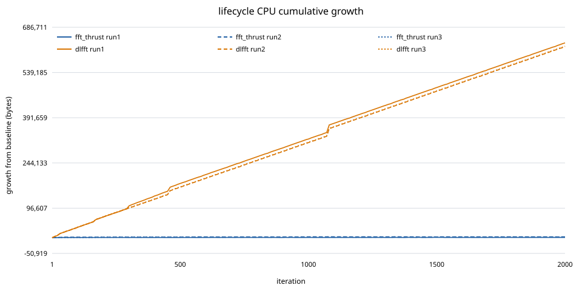
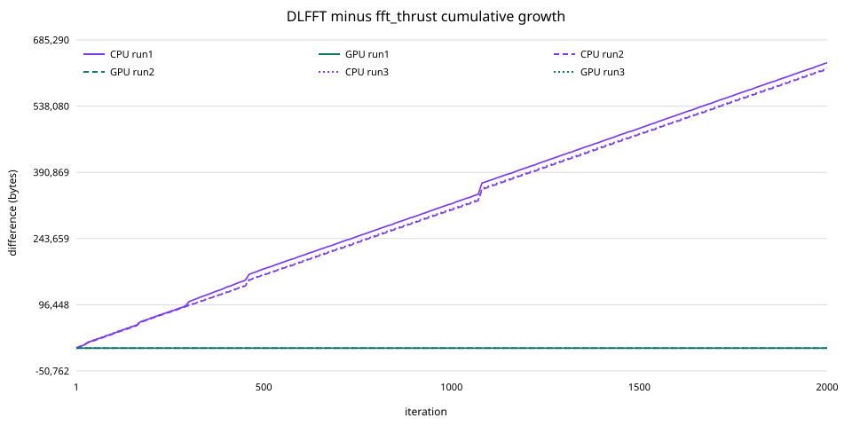
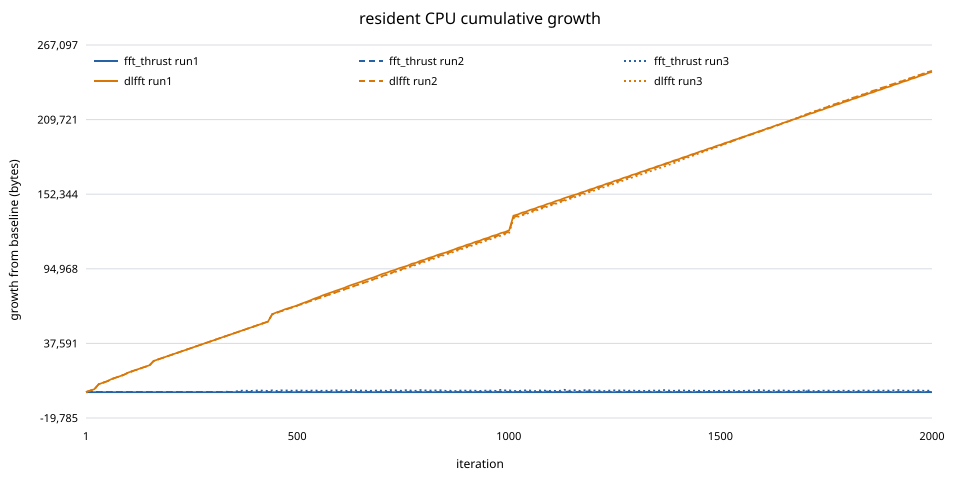
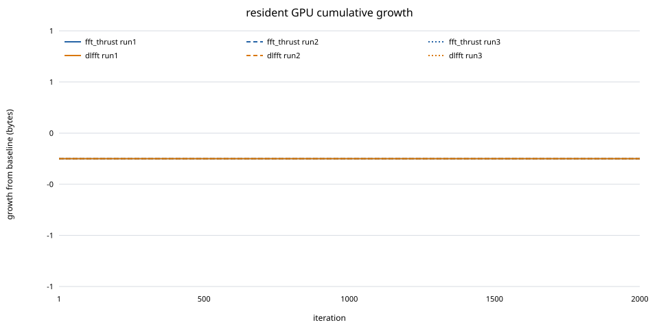

# ZQ500 FFT 后端统一内存稳定性测试报告

> 本报告由 `analyze_fft_backend_memory.py` 从本轮原始 CSV 自动生成；数值、表格、曲线和分类不得人工回填。

## 1. 结论

完整生命周期自动分类：`dlfft_reproducible_cpu_leak`。当前 SDK 的 dlfft 完整调用生命周期存在可重复的同进程 CPU 内存泄漏；fft_thrust 在该测试条件下未观察到同类增长。

常驻执行自动分类：`dlfft_reproducible_cpu_leak`。当前 SDK 的 dlfft 在常驻执行场景存在可重复的同进程 CPU 内存泄漏；fft_thrust 在该测试条件下未观察到同类增长。

结论只覆盖 ZQ500 `gpu_02`、长度 1024、batch 1、complex64、100 轮预热、2,000 轮正式数据及本文同步/采样流程，不外推到其他长度、类型、batch 或并发场景。

## 2. 统一测试流程


测试框架、输入、四阶段采样、错误检查和 CSV 写入完全共用。两个构建目录只替换 `fft_execute` 的正式实现源：`fft_thrust.cu` 或 `fft_dlfft.cu`；后者内部调用 `cufftExecC2C`。

接口结构上，两端都通过项目正式 `FFTPlanHandle` API 创建和销毁执行对象。DLFFT plan 内部持有 SDK `cufftHandle`，销毁时调用 `cufftDestroy`；fft_thrust plan 内部持有 radix-2 twiddle/workspace device buffer，销毁时逐项 `tracked_cuda_free` 并检查返回值。测试框架还统一申请和释放同样的外部输入/输出 buffer。

## 3. 构建与运行命令

必须先按 `docs/development/ZQ500_RUNTIME.md` 完成本地核对、宿主机同步、精确 `docker cp`、交互进入 `gpu_02` 和 SDK 初始化。容器内命令为：

```bash
source /zq500/sdk/env.sh
cd /tmp/ZKX_dev
cmake -S . -B build_fft_memory_thrust -DUSE_DLFFT=OFF -DUSE_THRUST=ON
cmake --build build_fft_memory_thrust --target fft_backend_memory_unified -j1
cmake -S . -B build_fft_memory_dlfft -DUSE_DLFFT=ON -DUSE_THRUST=OFF
cmake --build build_fft_memory_dlfft --target fft_backend_memory_unified -j1
bash test_all/operators/run_fft_backend_memory_campaign.sh \
  ./build_fft_memory_thrust/test_all/operators/fft_backend_memory_unified \
  ./build_fft_memory_dlfft/test_all/operators/fft_backend_memory_unified \
  fft_backend_memory_unified_20260720
```

## 4. 输出正确性预检

两种后端使用同一输入，并与 CPU DFT reference 比较。容差 0.00335775008；fft_thrust 最大绝对误差 0.000503546819，dlfft 最大绝对误差 0.000503225874，后端间最大差异 0.00010004499，状态 `passed`。

## 5. 完整生命周期结果

| run | 序列 | 资源 | 净增长/B | 前100/B | 后100/B | 前1000/B | 后1000/B | 正/负/零 | 单步均值/B | 中位数/B | 最小/B | 最大/B | 斜率/B·轮⁻¹ | R² |
| ---: | --- | --- | ---: | ---: | ---: | ---: | ---: | ---: | ---: | ---: | ---: | ---: | ---: | ---: |
| 1 | fft_thrust | CPU | 1312 | 1104 | 48 | 1024 | 288 | 656/646/698 | 0.656000000 | 0.000000000 | -576 | 784 | 0.146356453 | 0.329072976 |
| 1 | fft_thrust | GPU | 0 | 0 | 0 | 0 | 0 | 0/0/2000 | 0.000000000 | 0.000000000 | 0 | 0 | 0.000000000 | 1.000000000 |
| 1 | dlfft | CPU | 635840 | 34208 | 29168 | 322848 | 312992 | 1841/151/8 | 317.920000000 | 288.000000000 | -528 | 22224 | 319.015970510 | 0.998793006 |
| 1 | dlfft | GPU | 0 | 0 | 0 | 0 | 0 | 0/0/2000 | 0.000000000 | 0.000000000 | 0 | 0 | 0.000000000 | 1.000000000 |
| 1 | dlfft-fft_thrust | CPU | 634528 | 33104 | 29120 | 321824 | 312704 | 1810/168/22 | 317.264000000 | 288.000000000 | -1040 | 22176 | 318.869614057 | 0.998796346 |
| 1 | dlfft-fft_thrust | GPU | 0 | 0 | 0 | 0 | 0 | 0/0/2000 | 0.000000000 | 0.000000000 | 0 | 0 | 0.000000000 | 1.000000000 |
| 2 | fft_thrust | CPU | 3152 | 2208 | 128 | 3152 | 0 | 700/728/572 | 1.576000000 | 0.000000000 | -640 | 640 | 0.674947945 | 0.616059180 |
| 2 | fft_thrust | GPU | 0 | 0 | 0 | 0 | 0 | 0/0/2000 | 0.000000000 | 0.000000000 | 0 | 0 | 0.000000000 | 1.000000000 |
| 2 | dlfft | CPU | 623440 | 34240 | 28976 | 310608 | 312832 | 1861/127/12 | 311.720000000 | 288.000000000 | -576 | 21984 | 313.947985147 | 0.999176317 |
| 2 | dlfft | GPU | 0 | 0 | 0 | 0 | 0 | 0/0/2000 | 0.000000000 | 0.000000000 | 0 | 0 | 0.000000000 | 1.000000000 |
| 2 | dlfft-fft_thrust | CPU | 620288 | 32032 | 28848 | 307456 | 312832 | 1765/206/29 | 310.144000000 | 288.000000000 | -864 | 21936 | 313.273037202 | 0.999198536 |
| 2 | dlfft-fft_thrust | GPU | 0 | 0 | 0 | 0 | 0 | 0/0/2000 | 0.000000000 | 0.000000000 | 0 | 0 | 0.000000000 | 1.000000000 |
| 3 | fft_thrust | CPU | 2864 | 1424 | 0 | 2224 | 640 | 600/582/818 | 1.432000000 | 0.000000000 | -576 | 928 | 0.544052212 | 0.494080893 |
| 3 | fft_thrust | GPU | 0 | 0 | 0 | 0 | 0 | 0/0/2000 | 0.000000000 | 0.000000000 | 0 | 0 | 0.000000000 | 1.000000000 |
| 3 | dlfft | CPU | 624992 | 34736 | 29440 | 311712 | 313280 | 1865/128/7 | 312.496000000 | 288.000000000 | -464 | 22272 | 314.205672023 | 0.999183048 |
| 3 | dlfft | GPU | 0 | 0 | 0 | 0 | 0 | 0/0/2000 | 0.000000000 | 0.000000000 | 0 | 0 | 0.000000000 | 1.000000000 |
| 3 | dlfft-fft_thrust | CPU | 622128 | 33312 | 29440 | 309488 | 312640 | 1832/161/7 | 311.064000000 | 288.000000000 | -816 | 22272 | 313.661619811 | 0.999164918 |
| 3 | dlfft-fft_thrust | GPU | 0 | 0 | 0 | 0 | 0 | 0/0/2000 | 0.000000000 | 0.000000000 | 0 | 0 | 0.000000000 | 1.000000000 |






## 6. 常驻执行结果

| run | 序列 | 资源 | 净增长/B | 前100/B | 后100/B | 前1000/B | 后1000/B | 正/负/零 | 单步均值/B | 中位数/B | 最小/B | 最大/B | 斜率/B·轮⁻¹ | R² |
| ---: | --- | --- | ---: | ---: | ---: | ---: | ---: | ---: | ---: | ---: | ---: | ---: | ---: | ---: |
| 1 | fft_thrust | CPU | 48 | 48 | 0 | 48 | 0 | 26/26/1948 | 0.024000000 | 0.000000000 | -480 | 480 | 0.000366240 | 0.000065011 |
| 1 | fft_thrust | GPU | 0 | 0 | 0 | 0 | 0 | 0/0/2000 | 0.000000000 | 0.000000000 | 0 | 0 | 0.000000000 | 1.000000000 |
| 1 | dlfft | CPU | 246416 | 15072 | 11200 | 124656 | 121760 | 1095/882/23 | 123.208000000 | 80.000000000 | -560 | 10000 | 123.666000089 | 0.998544655 |
| 1 | dlfft | GPU | 0 | 0 | 0 | 0 | 0 | 0/0/2000 | 0.000000000 | 0.000000000 | 0 | 0 | 0.000000000 | 1.000000000 |
| 1 | dlfft-fft_thrust | CPU | 246368 | 15024 | 11200 | 124608 | 121760 | 1105/872/23 | 123.184000000 | 80.000000000 | -608 | 10000 | 123.665633848 | 0.998545442 |
| 1 | dlfft-fft_thrust | GPU | 0 | 0 | 0 | 0 | 0 | 0/0/2000 | 0.000000000 | 0.000000000 | 0 | 0 | 0.000000000 | 1.000000000 |
| 2 | fft_thrust | CPU | 208 | 208 | 0 | 208 | 0 | 179/172/1649 | 0.104000000 | 0.000000000 | -1056 | 1056 | 0.001779720 | 0.000103746 |
| 2 | fft_thrust | GPU | 0 | 0 | 0 | 0 | 0 | 0/0/2000 | 0.000000000 | 0.000000000 | 0 | 0 | 0.000000000 | 1.000000000 |
| 2 | dlfft | CPU | 247280 | 15072 | 11328 | 123136 | 124144 | 1537/422/41 | 123.640000000 | 112.000000000 | -656 | 10208 | 124.025893150 | 0.998902503 |
| 2 | dlfft | GPU | 0 | 0 | 0 | 0 | 0 | 0/0/2000 | 0.000000000 | 0.000000000 | 0 | 0 | 0.000000000 | 1.000000000 |
| 2 | dlfft-fft_thrust | CPU | 247072 | 14864 | 11328 | 122928 | 124144 | 1505/458/37 | 123.536000000 | 112.000000000 | -944 | 9856 | 124.024113430 | 0.998927098 |
| 2 | dlfft-fft_thrust | GPU | 0 | 0 | 0 | 0 | 0 | 0/0/2000 | 0.000000000 | 0.000000000 | 0 | 0 | 0.000000000 | 1.000000000 |
| 3 | fft_thrust | CPU | 1216 | 112 | 0 | 1472 | -256 | 782/841/377 | 0.608000000 | 0.000000000 | -1120 | 992 | 0.517307793 | 0.323803885 |
| 3 | fft_thrust | GPU | 0 | 0 | 0 | 0 | 0 | 0/0/2000 | 0.000000000 | 0.000000000 | 0 | 0 | 0.000000000 | 1.000000000 |
| 3 | dlfft | CPU | 247280 | 14928 | 11200 | 122544 | 124736 | 1924/76/0 | 123.640000000 | 112.000000000 | -560 | 10096 | 123.945903950 | 0.999062026 |
| 3 | dlfft | GPU | 0 | 0 | 0 | 0 | 0 | 0/0/2000 | 0.000000000 | 0.000000000 | 0 | 0 | 0.000000000 | 1.000000000 |
| 3 | dlfft-fft_thrust | CPU | 246064 | 14816 | 11200 | 121072 | 124992 | 1351/642/7 | 123.032000000 | 112.000000000 | -1376 | 10448 | 123.428596157 | 0.999055620 |
| 3 | dlfft-fft_thrust | GPU | 0 | 0 | 0 | 0 | 0 | 0/0/2000 | 0.000000000 | 0.000000000 | 0 | 0 | 0.000000000 | 1.000000000 |





## 7. 指定轮次真实数据

### 完整生命周期：run 1 指定轮次原始增长值

| iteration | fft_thrust CPU/B | dlfft CPU/B | CPU差分/B | fft_thrust GPU/B | dlfft GPU/B |
| ---: | ---: | ---: | ---: | ---: | ---: |
| 1 | 48 | 288 | 240 | 0 | 0 |
| 2 | 48 | 400 | 352 | 0 | 0 |
| 3 | -48 | 704 | 752 | 0 | 0 |
| 4 | 0 | 912 | 912 | 0 | 0 |
| 5 | 528 | 1280 | 752 | 0 | 0 |
| 6 | 512 | 2192 | 1680 | 0 | 0 |
| 7 | 464 | 2320 | 1856 | 0 | 0 |
| 8 | 512 | 3216 | 2704 | 0 | 0 |
| 9 | 464 | 3520 | 3056 | 0 | 0 |
| 10 | 512 | 3808 | 3296 | 0 | 0 |
| 991 | 1168 | 320224 | 319056 | 0 | 0 |
| 992 | 1216 | 320480 | 319264 | 0 | 0 |
| 993 | 1072 | 320576 | 319504 | 0 | 0 |
| 994 | 1216 | 320960 | 319744 | 0 | 0 |
| 995 | 1072 | 321200 | 320128 | 0 | 0 |
| 996 | 1216 | 321552 | 320336 | 0 | 0 |
| 997 | 1168 | 321840 | 320672 | 0 | 0 |
| 998 | 1120 | 322128 | 321008 | 0 | 0 |
| 999 | 1216 | 322560 | 321344 | 0 | 0 |
| 1000 | 1024 | 322848 | 321824 | 0 | 0 |
| 1001 | 1280 | 322416 | 321136 | 0 | 0 |
| 1002 | 1168 | 323376 | 322208 | 0 | 0 |
| 1003 | 1024 | 323664 | 322640 | 0 | 0 |
| 1004 | 1216 | 323712 | 322496 | 0 | 0 |
| 1005 | 1168 | 324144 | 322976 | 0 | 0 |
| 1006 | 1216 | 324304 | 323088 | 0 | 0 |
| 1007 | 1168 | 324784 | 323616 | 0 | 0 |
| 1008 | 1280 | 324496 | 323216 | 0 | 0 |
| 1009 | 1120 | 325280 | 324160 | 0 | 0 |
| 1010 | 1168 | 325568 | 324400 | 0 | 0 |
| 1991 | 1264 | 633392 | 632128 | 0 | 0 |
| 1992 | 1312 | 633600 | 632288 | 0 | 0 |
| 1993 | 1216 | 633376 | 632160 | 0 | 0 |
| 1994 | 1216 | 634288 | 633072 | 0 | 0 |
| 1995 | 1312 | 634672 | 633360 | 0 | 0 |
| 1996 | 1312 | 634864 | 633552 | 0 | 0 |
| 1997 | 1312 | 635152 | 633840 | 0 | 0 |
| 1998 | 1312 | 635456 | 634144 | 0 | 0 |
| 1999 | 1312 | 635552 | 634240 | 0 | 0 |
| 2000 | 1312 | 635840 | 634528 | 0 | 0 |

### 常驻执行：run 1 指定轮次原始增长值

| iteration | fft_thrust CPU/B | dlfft CPU/B | CPU差分/B | fft_thrust GPU/B | dlfft GPU/B |
| ---: | ---: | ---: | ---: | ---: | ---: |
| 1 | 0 | 224 | 224 | 0 | 0 |
| 2 | 48 | 304 | 256 | 0 | 0 |
| 3 | 48 | 416 | 368 | 0 | 0 |
| 4 | 48 | 528 | 480 | 0 | 0 |
| 5 | 48 | 640 | 592 | 0 | 0 |
| 6 | 48 | 752 | 704 | 0 | 0 |
| 7 | 48 | 864 | 816 | 0 | 0 |
| 8 | 48 | 976 | 928 | 0 | 0 |
| 9 | 48 | 1088 | 1040 | 0 | 0 |
| 10 | 48 | 1200 | 1152 | 0 | 0 |
| 991 | 48 | 123264 | 123216 | 0 | 0 |
| 992 | 48 | 123760 | 123712 | 0 | 0 |
| 993 | 176 | 123776 | 123600 | 0 | 0 |
| 994 | 48 | 123728 | 123680 | 0 | 0 |
| 995 | 48 | 123712 | 123664 | 0 | 0 |
| 996 | 48 | 124208 | 124160 | 0 | 0 |
| 997 | 48 | 124192 | 124144 | 0 | 0 |
| 998 | 48 | 124176 | 124128 | 0 | 0 |
| 999 | 48 | 124160 | 124112 | 0 | 0 |
| 1000 | 48 | 124656 | 124608 | 0 | 0 |
| 1001 | 48 | 124640 | 124592 | 0 | 0 |
| 1002 | 48 | 124624 | 124576 | 0 | 0 |
| 1003 | 48 | 124608 | 124560 | 0 | 0 |
| 1004 | 48 | 125104 | 125056 | 0 | 0 |
| 1005 | 48 | 125088 | 125040 | 0 | 0 |
| 1006 | 48 | 125072 | 125024 | 0 | 0 |
| 1007 | 48 | 125056 | 125008 | 0 | 0 |
| 1008 | 48 | 125552 | 125504 | 0 | 0 |
| 1009 | 48 | 135552 | 135504 | 0 | 0 |
| 1010 | 48 | 135680 | 135632 | 0 | 0 |
| 1991 | 48 | 245536 | 245488 | 0 | 0 |
| 1992 | 48 | 245520 | 245472 | 0 | 0 |
| 1993 | 48 | 245504 | 245456 | 0 | 0 |
| 1994 | 48 | 246000 | 245952 | 0 | 0 |
| 1995 | 48 | 245984 | 245936 | 0 | 0 |
| 1996 | 48 | 245968 | 245920 | 0 | 0 |
| 1997 | 48 | 245952 | 245904 | 0 | 0 |
| 1998 | 48 | 246448 | 246400 | 0 | 0 |
| 1999 | 48 | 246432 | 246384 | 0 | 0 |
| 2000 | 48 | 246416 | 246368 | 0 | 0 |

完整三次重复的这些轮次见 `report_samples.csv`；完整 2,000 轮见 `raw/` 和 `comparison/`。

## 8. 指标边界

`mallinfo2().uordblks` 是 glibc allocator 当前仍分配空间，不等于 RSS；VmRSS 只作辅助，RSS 不下降不能直接判泄漏。GPU 使用同序的 `cudaMemGetInfo(total-free)`，是设备级视图。主要判据始终是资源释放后的累计增长、后 1,000 轮是否仍增长、三次独立进程能否复现，以及 DLFFT−fft_thrust 差分是否扩大。自动持续增长判据要求净增长大于 64 KiB、后 1,000 轮增长大于 32 KiB、全窗斜率大于 1 B/轮且 R² 大于 0.9；不要求每轮上涨，也不使用正负步数比例作硬门槛。

## 9. 交付清单

- 统一测试源码：`test_all/operators/performance/fft_backend_memory_unified.cu`；
- 后端适配：正式 `fft_thrust.cu` 与 `fft_dlfft.cu`；
- CMake：目标 `fft_backend_memory_unified`；
- 自动运行：`run_fft_backend_memory_campaign.sh`；
- 统计与绘图：`analyze_fft_backend_memory.py`；
- 原始数据：`raw/` 中正确性输出、生命周期 6 个 CSV、常驻执行 6 个 CSV 及 cleanup CSV；
- 对照数据：`analysis/comparison/`、`lifecycle_all_runs.csv`、`resident_all_runs.csv`；
- 统计与抽样：`backend_memory_summary.csv`、`report_samples.csv`、`manifest.json`；
- 曲线：`analysis/figures/` 中 5 张由 CSV 自动生成的 SVG。
